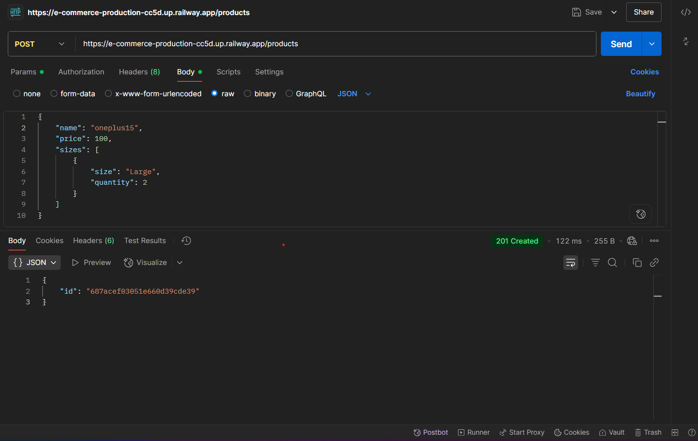

```markdown
# HROne Ecommerce Backend API

**A FastAPI + MongoDB powered backend for a simple ecommerce app, containerized with Docker.**

---

## Table of Contents

- [Project Structure](#project-structure)
- [Features & API Overview](#features--api-overview)
- [Code Walkthrough](#code-walkthrough)
- [Running Locally](#running-locally)
- [Running with Docker](#running-with-docker)
- [Environment Variables](#environment-variables)
- [Example API Usage](#example-api-usage)
- [Notes](#notes)

---

## Project Structure

```

/
├── main.py           \# FastAPI application with all route and DB logic
├── requirements.txt  \# Python dependencies
├── Dockerfile        \# Container instructions for deployment
├── .env.example      \# Sample for required environment variables
└── README.md         \# This documentation

```

---

## Features & API Overview

- **Product Management**  
  - Add new products (with multiple sizes, each with its own quantity)
  - List products with filtering by name (search) or size, with pagination

- **Order Management**  
  - Place an order for any number of products by productId and quantity
  - Retrieve orders for a specific user, showing item details and computed order totals

- **Database**  
  - All data is stored in MongoDB
  - Robust ObjectId->string conversion for API output

- **Deployment**  
  - Dockerfile for production container builds

---

## Code Walkthrough

### `main.py`

- **Configuration:**  
  - Loads environment variables using `python-dotenv`
  - Connects to MongoDB via the `MONGO_URL` environment variable (defaults to `mongodb://localhost:27017/`)

- **Data Models:**  
  - `ProductCreate` (`name`, `price`, `sizes` where each size has string `size` and integer `quantity`)
  - `OrderCreate` (`userId`, and a list of `OrderItem` objects: each with `productId` and `qty`)

- **Helper:**  
  - `object_id_to_string(obj)`: Recursively turns all MongoDB ObjectIds into strings for JSON responses

- **Routes:**  
  - `GET /`: Returns a simple health check
  - `POST /products`: Adds a product, returns new product ID
  - `GET /products`: Lists products, supports optional name regex & size filtering, paginates results
  - `POST /orders`: Places an order; returns the new order ID
  - `GET /orders/{user_id}`: Lists one user’s orders, with each item expanded to include product name and computes total order cost

- **Pagination:**  
  - All listing APIs (`products` and user’s `orders`) include `limit`, `offset`, and next/previous page indices

- **Entry Point:**  
  - If run directly, launches the server at `0.0.0.0:8000`

### `Dockerfile`

- Based on `python:3.11-slim`
- Sets `/app` as the working directory
- Installs system and Python dependencies
- Copies all source code into the image
- Launches the app using `python main.py`

---

## Running Locally

1. **Set up your environment variables:**

   - Copy `.env.example` to `.env`:  
     ```
     cp .env.example .env
     ```
   - Fill in your real MongoDB connection string in `.env`.
   
2. **Install dependencies and run development server:**

```

pip install -r requirements.txt
uvicorn main:app --reload

```

3. **Visit** [http://localhost:8000](http://localhost:8000) in your browser to test.

---

## Running with Docker

1. **Build Docker image:**
```

docker build -t hrone-ecommerce-api .

```

2. **Run the container:**
```

docker run --env-file .env -p 8000:8000 hrone-ecommerce-api

```

3. The app is live on your machine at [http://localhost:8000](http://localhost:8000).

---

## Environment Variables

- **`.env` file (sample in `.env.example`):**
```

MONGO_URL=mongodb+srv://<username>:<password>@host/db

```

---

## Example API Usage

### Create Product
```

POST /products
{
"name": "Blue T-Shirt",
"price": 20.0,
"sizes": [
{"size": "M", "quantity": 10},
{"size": "L", "quantity": 5}
]
}




```

### List Products
```

GET /products?name=Shirt\&size=M\&limit=10\&offset=0


```

### Create Order
```

POST /orders
{
"userId": "john123",
"items": [{"productId": "64abc1234567890ffedcba99", "qty": 2}]
}


```

### Get User Orders
```

GET /orders/john123


```
Returns all of john123's orders, each with product details and computed total price.

---

## Notes

- This project assumes a running MongoDB instance. You can use Atlas or run MongoDB locally.
- All MongoDB ObjectIds are automatically converted to strings for safe API responses.
- Never commit real `.env` or secret credentials to your repository.
- For production deployment, always set your environment variables securely (not committed, but injected via CI/CD or cloud dashboard).

---

**Maintained for HROne Backend Intern coding task demonstration.**
```

<div style="text-align: center">⁂</div>

[^1]: main.py

[^2]: Dockerfile

